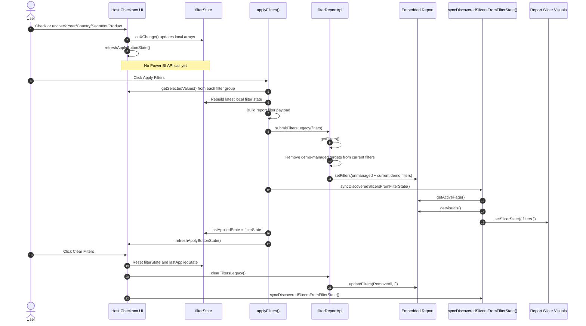

# VISA Slicer Demo Technical README

## Purpose

This document describes the runtime path used by the demo to manage filter state between the host page and the embedded Power BI report.

The demo uses a host-managed deferred filtering model:

- Filter selections are made in HTML checkboxes outside the Power BI iframe.
- Selections are stored in local JavaScript state first.
- No report update happens until the user clicks Apply.
- Apply updates both report-level filters and the visible slicer visuals inside the embedded report.

## High-Level Architecture

There are two distinct filter state layers in the demo:

1. Host filter state
   Stored in the `filterState` JavaScript object for `year`, `country`, `segment`, and `product`.

2. Embedded report filter state
   Applied through the Power BI JavaScript SDK on the embedded `report` object.

The host page is the source of truth. The embedded slicers are synchronized after the host state has already been applied to the report.

## Filter Control Flow

## Function-Level Description

### 1. UI rendering and selection capture

`renderCheckboxOptions(containerId, values, selectedValues, changeHandler)`

- Creates the checkbox controls for each filter group.
- Attaches a `change` event handler to every checkbox.
- Is used by:
  - `populateYearDropdown()`
  - `populateCountryDropdown()`
  - `populateSegmentDropdown()`
  - `populateProductDropdown()`

`getSelectedValues(selectId)`

- Reads the checked boxes from a filter container.
- Returns an array of selected values.
- Used both during change events and again at Apply time.

### 2. Deferred local state updates

`onYearChange()`

- Reads current Year selections.
- Writes them to `filterState.year`.
- Calls `refreshApplyButtonState()`.

`onCountryChange()`

- Reads current Country selections.
- Writes them to `filterState.country`.
- Calls `refreshApplyButtonState()`.

`onSegmentChange()`

- Reads current Segment selections.
- Writes them to `filterState.segment`.
- Calls `populateProductDropdown(values)` to enforce the host-side Segment -> Product cascade.
- Calls `refreshApplyButtonState()`.

`onProductChange()`

- Reads current Product selections.
- Writes them to `filterState.product`.
- Calls `refreshApplyButtonState()`.

`refreshApplyButtonState()`

- Compares `filterState` to `lastAppliedState`.
- Updates the Apply button label, including the pending selection count.
- Does not call the Power BI API.

### 3. Apply path

`applyFilters()`

- Entry point for the Apply button.
- Re-reads all checkbox groups using `getSelectedValues()` so the submit path always uses current UI state.
- Builds one filter object per logical field when that field has selected values.
- Calls `submitFiltersLegacy(filters)` to mutate report-level filters.
- Calls `syncDiscoveredSlicersFromFilterState()` so the in-report slicer visuals display the same selections.
- Copies `filterState` into `lastAppliedState` after success.

### 4. Report-level filter mutation

`submitFiltersLegacy(filters)`

- Uses the embedded report object stored in `filterReportApi`.
- Calls `filterReportApi.getFilters()` to read current report-level filters.
- Uses `buildManagedTargetSet()` to identify which targets are controlled by the host demo.
- Uses `isManagedFilterTarget(target, managedTargets)` to separate demo-managed filters from unrelated report filters.
- Calls `filterReportApi.setFilters(unmanagedFilters.concat(filters))`.

This behavior matters because it:

- Replaces the demo-managed filter set with the latest host state.
- Preserves unrelated report filters that may exist outside the host demo.
- Clears a previously applied field when that field is omitted from the new Apply payload.

### 5. Slicer visual synchronization

`discoverSlicerBindings(forceRefresh = false)`

- Uses `report.getActivePage()` and `page.getVisuals()` to inspect visuals on the active page.
- For slicer visuals, calls `visual.getSlicerState()`.
- Infers which visual corresponds to `year`, `country`, `segment`, or `product`.
- Stores the discovered mapping in `slicerBindings`.

`syncDiscoveredSlicersFromFilterState()`

- Re-discovers slicer bindings if needed.
- Gets the active page and all visuals.
- For each known filter key, builds a `models.BasicFilter` using the selected values in `filterState`.
- Calls `visual.setSlicerState({ filters: slicerFilters })` on the matched slicer visual.

This step is separate from report-level filtering. The report data can already be filtered before slicer visuals are visually updated.

### 6. Clear path

`clearFilters()`

- Resets `filterState` and `lastAppliedState`.
- Unchecks all host-side checkboxes.
- Re-renders the filter groups.
- Calls `clearFiltersLegacy()`.
- Calls `syncDiscoveredSlicersFromFilterState()` to visually clear the embedded slicers.

`clearFiltersLegacy()`

- Calls `filterReportApi.updateFilters(models.FiltersOperations.RemoveAll, [])`.
- Clears all report-level filters from the embedded report.

## Embed-Time API Initialization

`embedReport()` is responsible for creating the Power BI report object used later by Apply and Clear.

Runtime sequence:

1. `ensurePowerBIService()` verifies the SDK is available.
2. `pbiService.embed(reportContainer, config)` creates the embedded report instance.
3. The `loaded` event marks the report as API-ready.
4. `filterReportApi = report` stores the report object used by `submitFiltersLegacy()` and `clearFiltersLegacy()`.
5. The `rendered` event enables the visible filter UI and triggers slicer discovery.

Without this embed-time initialization, Apply and Clear have no report object to call.

## Runtime Summary

The demo does not treat the Power BI slicer visuals as the primary interaction model. Instead:

- The host HTML controls own the user interaction.
- `filterState` is the primary state store.
- Apply converts host state into report-level filters.
- A second pass updates visible slicer visuals to match the host state.

That design is what enables:

- Mobile-friendly multi-select without Ctrl+Click
- Deferred execution with an explicit Apply step
- Host-side cascading logic before the report is updated
- A curated interaction model outside the Power BI iframe